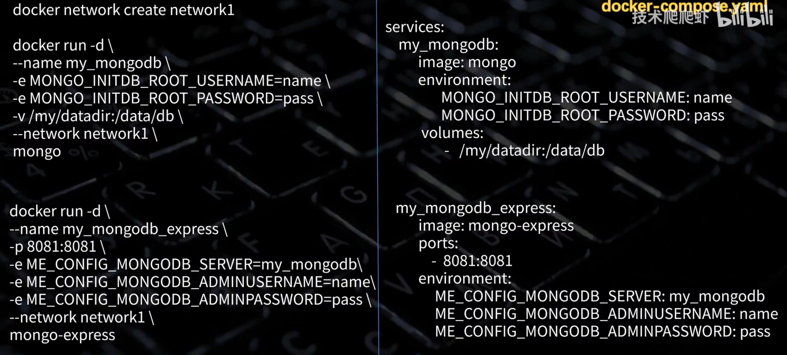

## Docker Learn

对 https://www.bilibili.com/video/BV1THKyzBER6/?spm_id_from=333.337.search-card.all.click 的学习笔记

### 一、基础概念

1、image 镜像：类比安装包

2、container 容器：类比app

3、repository 仓库：镜像集

4、Dockerfile：镜像的图纸，类比安装包的设计图纸

5、docker：

​	只要容器处于 **运行状态**，且镜像内包含 **Shell 解析器**（如 `/bin/sh` 或 `/bin/bash`），就可以使用 `docker exec` 进入其中，像个操作系统一样。

+++

### 二、Image 镜像

1、`docker pull docker.io/library/nginx:latest` ：下载镜像

​			      （仓库地址 / 作者名 / 镜像名 : 版本）

​			      （仓库地址，作者名，是官方时克省略；版本为 latest 时可省略）

2、`docker build -t 镜像名 .` ：从当前目录下的Dockerfile文件构建镜像

3、`docker images` ：列出镜像

4、`docker rmi ID/镜像名`：删除镜像

+++

### 三、Container 容器

1、`docker run nginx(镜像名)`：使用镜像创建并运行容器，但容器名随机

​	**以下的 可选参数 无先后顺序之分**

- `-d` ：后台运行	

​		`docker run -d nginx`

- `--name`：命名

	​	`docker run -name my-ngnix nginx`

- `-p`：端口映射。容器内网络（见容器网络）和主机隔离

​		`docker run -p 80:80 nginx`

- `-v`：挂载卷。进行容器内目录和主机目录相绑定，删除容器时，容器对文件的修改保留在主机内

​		`docker run -v /web/html:/usr/share/nginx/html nginx`：

​			初始化时，主机目录下的文件会覆盖容器目录下的文件

​		`docker run -v nginx_html:/usr/share/nginx/html nginx`：

​			初始化时，容器目录下文件会覆盖**命名卷（如下）**中文件

​			`docker volume create nginx_html`：创建命名卷

​			`docker volume inspect nginx_html`：查看命名卷在主机中的位置

- `-e`：传递环境变量

	​	`docker run -e MONGO_INITDB_ROOT_USERNAME=admin mongo`：

- `-it`：进入容器与之交互，如 ls、cd 等指令

- `--rm`：容器停止时删除容器

	​	`docker run -it --rm alpine`

- `--restart`：

	​	`docker run --restart always nginx`：

	​		容器因意外或手动停止时总是重启

	​	`docker run --restart unless-stopped nginx`：

	​		容器因意外停止时总是重启，手动停止不重启

	

2、`docker ps`：列出**正在运行**的容器

​      `docker ps -a`：列出**所有**的容器

3、`docker rm ID/容器名`：删除容器

​      `docker rm -f ID/容器名`：强制删除

+++

### 四、调试容器

1、`docker stop ID/容器名`：停止容器

2、`docker start ID/容器名`：启动容器。无需重新配置可选项

3、 `docker inspect ID/容器名`：查看容器信息

4、`docker create 镜像名`：使用镜像创建容器，但不运行

5、`docker logs ID/容器名 -f`：滚动查看容器日志

6、`docker exec -it ID/容器名 /bin/sh`：进入容器与之交互

7、`exit`：退出

+++

### 五、Dockerfile

```BASH
FROM python:3.13-slim
# 选择基础镜像

WORKDIR /app
# 设置工作目录

COPY . .
# 拷贝主机当前目录文件到容器的工作目录下

RUN pip install -r requirement.txt
# 用 “RUN + 指令” 来搭建依赖

EXPOSE 8000
# 端口暴露，仅起到声明和文档作用。
# 并不会自动完成端口映射，仍然需要在 docker run 时使用 -p

CMD ["python3","main.py"]
# 用该 Dockerfile 创建的镜像，创建容器后，容器启动时的默认命令
```

1、`docker build -t 镜像名 .` ：创建镜像（在当前目录下）

2、推送镜像：

​	`docker login`

​	`docker build -t 用户名/镜像名 .`

​	`docker push 用户名/镜像名`

+++

### 六、容器网络（待补充）

1. Bridge (桥接，默认)：每个容器分配一个虚拟 IP，通过宿主机的 `docker0` 网桥通信。最常用。 

2. Host (主机)：容器直接使用宿主机的网络栈（IP 和端口）。性能最高，但没有端口隔离。 

3. None (禁用)：容器只有 loopback (127.0.0.1)，不与外部联网，安全性极高。 

4. Custom Bridge (自定义网桥)：

- `docker network create my-net`
- `docker run --network my-net ...`
- 优势： 同一个网桥内的容器可以通过 **容器名** 互相访问（内置 DNS 解析），比 IP 更稳定。

+++

### 七、docker compose

**docker-compose.yaml 文件**



1、`docker compose up -d`：创建容器并运行（自动内置在同一个子网）

2、`docker compose down`：停止并删除

3、`docker compose stop`：停止

4、`docker compose start`：运行
