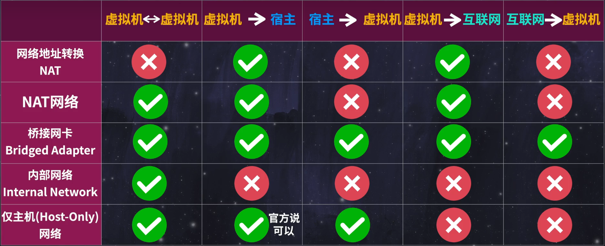

# 虚拟机网络

https://www.bilibili.com/video/BV11M4y1J7zP?vd_source=db6d41d1f902f7246b73881e8170cb8f&spm_id_from=333.788.videopod.sections

### 查看虚拟机的ip

1、输入  `if a`  ：

​	查看 **ens*** 下的 **inet** 后面的字段，一般在 ens33 的第二行

> [!NOTE]
>
> 注意是 **inet** 不是 **inet6**

2、`ping baidu.com`

### 三种网络模式（待补充）

#### 1、桥接：

- 独立的ip地址

- 和宿主机平级，可互相访问
- 相同桥接网络虚拟机互相访问
- 和外网相互访问

#### 2、NAT：

- 和宿主机类似于“父子关系”，建立在 VMnet8 网卡上
- 可通过 VMnet8 网卡单向访问宿主机
- 相同NAT虚拟机可互相访问
- 通过 VMnet8 网卡单向访问外网

#### 3、仅主机(HOST)：

- 建立在 VMnet1 网卡上
- 可通过 VMnet1 网卡和宿主机互相访问
- 相同HOST虚拟机可互相访问
- 和外网完全隔离

